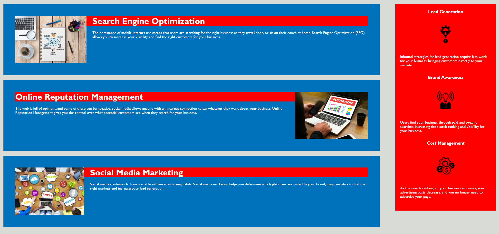
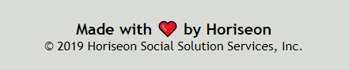

# Code Refactor
## 


One of the most common tasks for front-end and junior developers is to take existing code and refactor it to either meet a certain set of standards or implement a new technology. Web accessibility is an increasingly important consideration for businesses, ensuring that people with disabilities or socio-economic restrictions have access to their website, and helping them avoid litigation.

Your task is to refactor an existing webpage to make it accessible. An important rule to follow when working with someone else's code is the Scout Rule:

> Always leave the code you are editing a little cleaner than you found it.

To impress clients, you should always go the extra mile and improve their codebase for long term sustainability. Ensure that all links are functioning correctly and clean up the CSS to make it more efficient, consolidating CSS selectors and properties, organizing them to follow the semantic structure of the HTML elements, and including comments before each element or section of the page.

## User Story

```
Revamped site that is eye catching and easier to navigate. I wanted to bring a simple yet better innovated style to the language for easier rendering and editing capability for feature developer who will maintain the site on a day-to-day base.
```

## About


```
Horiseon:
This was a great company that I was able to help out. We were able to get a handful of issue's and problems that they executives wanted fixed. We were able to provide that help and much more.

```




## LINKS

- [Code Refactor Link](https://nicholasd-uci.github.io/code-refactor/)
- [Github Rep Link](https://github.com/nicholasd-uci/code-refactor)

- - -
© 2020 NPRD, Nicholas Paul Ruiz Dallas
